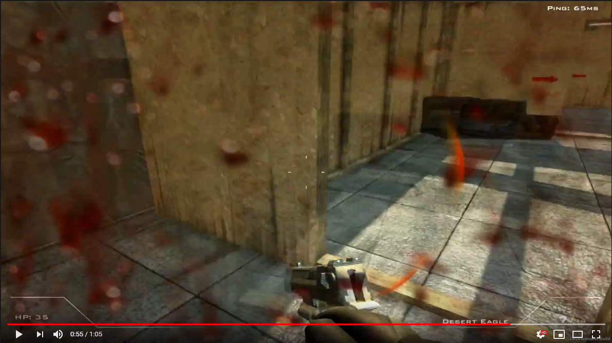
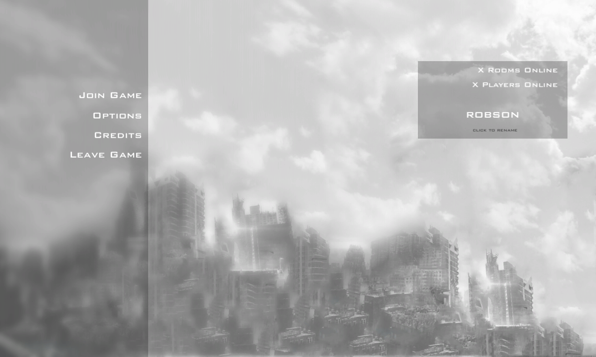
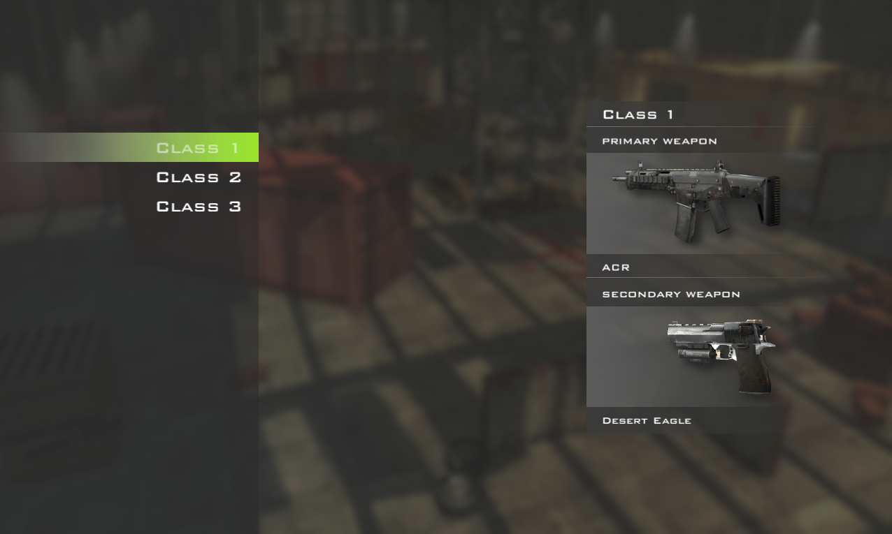
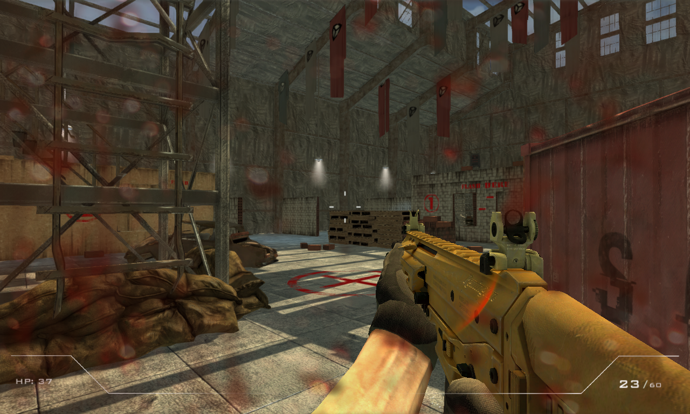
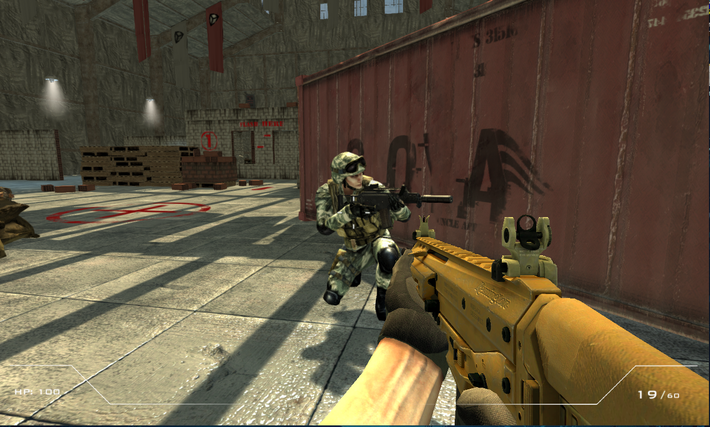

# Multiplayer FPS: Project Zero
Multiplayer FPS Shooter game based on Call of Duty: Modern Warfare 2 made in Unity

# About project
The project was created for educational purposes. It was aimed at learning the basics of the Unity engine and object oriented programming. I used many online tutorials and free assets from the Internet.

If you would like to try the game, download built version here: http://vps787568.ovh.net/ProjectZero.zip

If you would like a full Unity compatible version, write me a message.

# Video
Click to watch

# Screenshots

